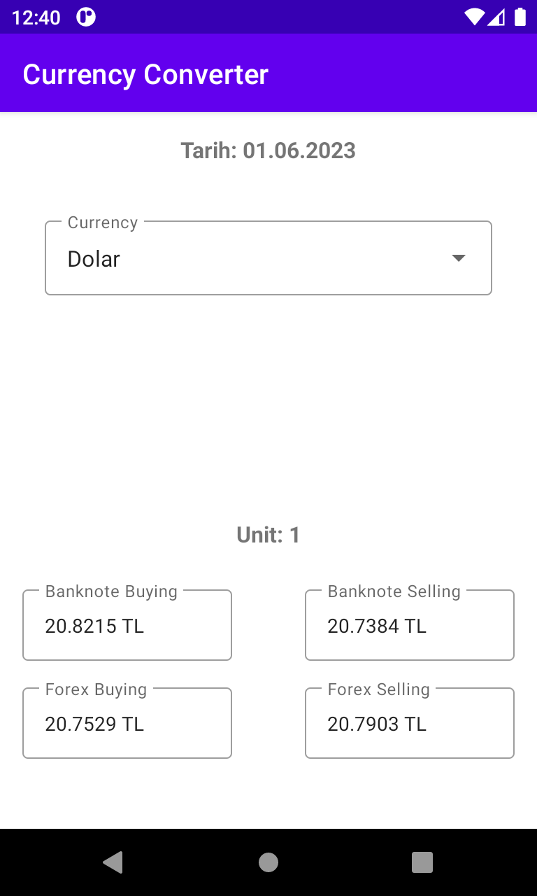
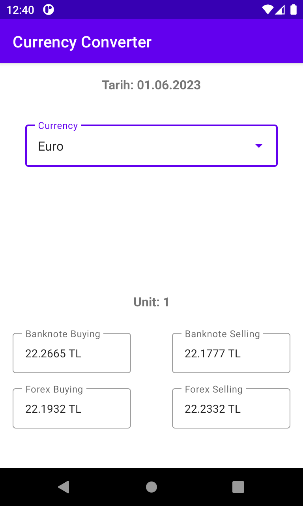
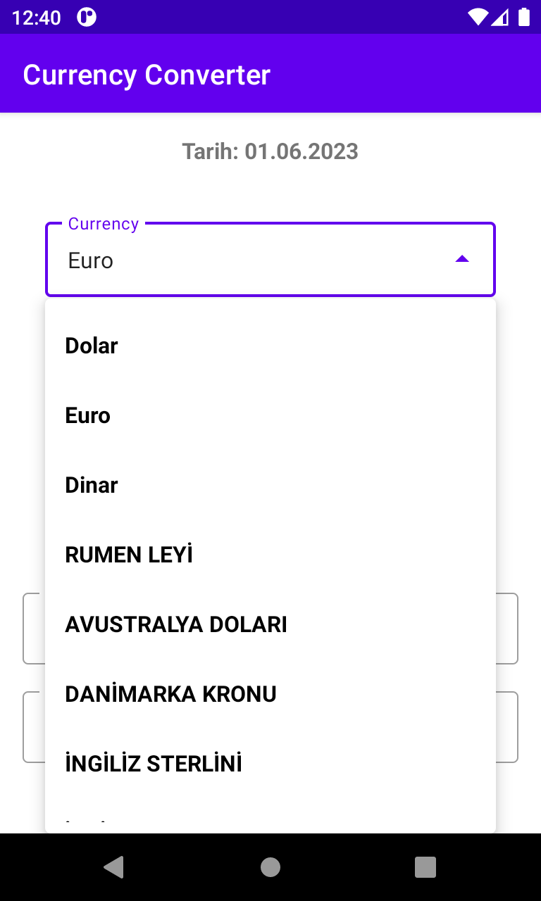
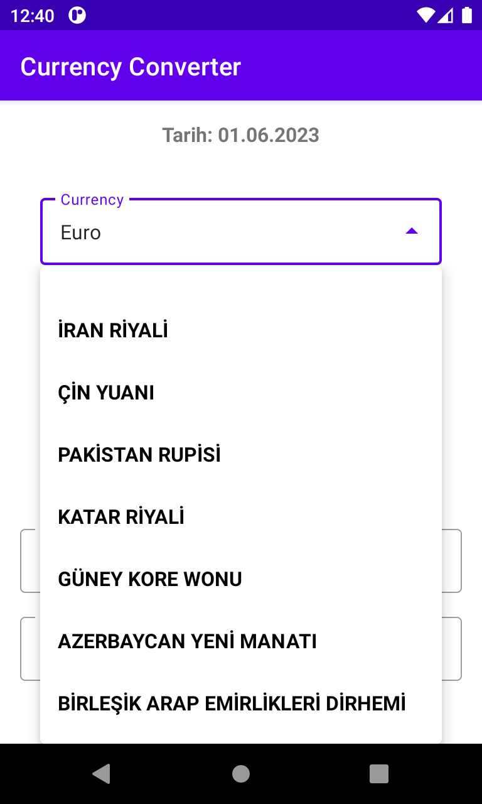

# Currecy Coverter Application
This repository demonstrates a mobile application built using Kotlin that functions as a currency converter. The application allows users to input a specific amount in one currency and convert it to another currency based on the latest exchange rates. It provides a user-friendly interface, with options to select the source and target currencies, as well as real-time exchange rate updates. The application utilizes APIs or services to fetch the latest exchange rates, ensuring accurate and up-to-date currency conversions. It showcases best practices in Kotlin development, including modular code organization, error handling, and user input validation. Additionally, the repository may include unit tests to ensure the accuracy and reliability of the currency conversion functionality. Overall, this repository serves as a comprehensive example for developers looking to create their own currency converter mobile applications using Kotlin.

# Demo

This demo; selects a currency and shows all values of that currency agains TL.

   
